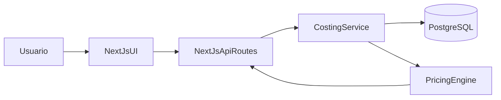

# Plan MVP: Costos de Producción para Restaurante

## Objetivo del MVP

Construir una web app que permita:

- Registrar insumos/materias primas con costo y unidad.
- Crear recetas usando cantidades de esos insumos.
- Calcular costo total por receta, costo por porción y precio sugerido de venta al público.

El MVP se enfoca en hamburguesas desde casa, pero el modelo será genérico para cualquier restaurante.

## Alcance inicial (MVP)

- **Incluye**
  - CRUD de insumos.
  - CRUD de recetas con múltiples ingredientes.
  - Parámetros de negocio: merma, costos indirectos, margen objetivo e impuestos.
  - Cálculo automático de precio sugerido.
  - Listado de recetas con semáforo básico de rentabilidad.
- **No incluye (v2)**
  - Inventario con movimientos de stock en tiempo real.
  - Multi-sucursal y multiusuario con roles complejos.
  - Integración con POS, facturación o proveedores.

## Stack propuesto

- **Frontend:** Next.js (App Router) + TypeScript + Tailwind + React Hook Form + Zod.
- **Backend:** API Routes de Next.js (BFF) con lógica de negocio en servicios.
- **Base de datos:** PostgreSQL + Prisma ORM.
- **Auth (simple para MVP):** NextAuth con email/password o acceso único inicial (si es uso personal al inicio).
- **Deploy:** Vercel (front+api) + Neon/Supabase (Postgres).

## Arquitectura funcional

## Modelo de datos MVP

Entidades clave:

- **Insumo**: nombre, categoría, unidad_base, costo_por_unidad, merma_pct, proveedor_opcional.
- **Receta**: nombre, tipo_producto, rendimiento_porciones, tiempo_preparacion_min.
- **RecetaInsumo**: receta_id, insumo_id, cantidad_en_unidad_base.
- **ConfiguracionCosteo**: overhead_pct, margen_objetivo_pct, impuesto_pct, redondeo_precio.
- **ResultadoCosteo** (calculado o persistido): costo_materia_prima, costo_total, costo_por_porcion, precio_sugerido.

Archivos iniciales esperados:

- `[app/page.tsx](app/page.tsx)`
- `[app/insumos/page.tsx](app/insumos/page.tsx)`
- `[app/recetas/page.tsx](app/recetas/page.tsx)`
- `[app/recetas/[id]/page.tsx](app/recetas/[id]/page.tsx)`
- `[app/configuracion/page.tsx](app/configuracion/page.tsx)`
- `[app/api/insumos/route.ts](app/api/insumos/route.ts)`
- `[app/api/recetas/route.ts](app/api/recetas/route.ts)`
- `[app/api/recetas/[id]/costeo/route.ts](app/api/recetas/[id]/costeo/route.ts)`
- `[lib/pricing/calculateSuggestedPrice.ts](lib/pricing/calculateSuggestedPrice.ts)`
- `[prisma/schema.prisma](prisma/schema.prisma)`

## Reglas de cálculo (MVP)

Para cada receta:

1. **Costo materia prima** = suma(cantidad_insumo * costo_unitario_ajustado_por_merma).
2. **Costo total** = costo_materia_prima * (1 + overhead_pct).
3. **Costo por porción** = costo_total / rendimiento_porciones.
4. **Precio sugerido sin impuesto** = costo_por_porción * (1 + margen_objetivo_pct).
5. **Precio sugerido final** = precio_sugerido_sin_impuesto * (1 + impuesto_pct), con redondeo comercial configurado.

## Fases de implementación

### Fase 1: Base técnica y datos

- Inicializar proyecto Next.js con TypeScript y Tailwind.
- Configurar Prisma + PostgreSQL.
- Crear migraciones para Insumo, Receta, RecetaInsumo y ConfiguracionCosteo.
- Seed con datos de ejemplo (pan, carne, queso, salsas, empaque).

### Fase 2: Gestión de insumos

- Pantalla para alta/edición/listado/borrado de insumos.
- Validaciones de unidades y costos.
- API REST simple para insumos.

### Fase 3: Gestión de recetas

- Formulario de receta con selección de insumos y cantidades.
- Definir rendimiento por porciones.
- Vista detalle de receta con desglose de costos por ingrediente.

### Fase 4: Motor de precio sugerido

- Implementar servicio de cálculo de costeo y precio.
- Pantalla de configuración global de margen, overhead e impuestos.
- Mostrar precio sugerido y margen estimado en tiempo real.

### Fase 5: Calidad mínima y despliegue

- Tests unitarios del motor de pricing.
- Pruebas funcionales básicas del flujo principal.
- Deploy en Vercel + DB gestionada.
- Documento corto de uso y supuestos del cálculo.

## API mínima sugerida

- `GET/POST /api/insumos`
- `PATCH/DELETE /api/insumos/:id`
- `GET/POST /api/recetas`
- `GET/PATCH/DELETE /api/recetas/:id`
- `GET /api/recetas/:id/costeo`
- `GET/PATCH /api/configuracion-costeo`

## UX mínima del flujo principal

1. Crear insumos con sus costos.
2. Crear receta de hamburguesa y asociar cantidades.
3. Definir rendimiento (ej. 1 receta = 4 hamburguesas).
4. Ajustar parámetros de margen/overhead/impuestos.
5. Ver precio sugerido final por unidad vendible.

## Métricas de éxito del MVP

- Tiempo para cargar una receta completa: < 5 minutos.
- Diferencia de cálculo manual vs sistema: < 2%.
- Al menos 10 recetas y 30 insumos cargados sin errores.
- Usuario puede recalcular precio sugerido en menos de 2 clics.

## Riesgos y mitigaciones

- **Unidades inconsistentes** (g, kg, ml, unidad): estandarizar unidad base por insumo.
- **Subestimación de costos indirectos**: incluir parámetro de overhead editable desde el inicio.
- **Datos incompletos de insumos**: forzar validaciones y defaults claros.

## Evolución posterior (v2)

- Costeo por combos/menús.
- Historial de precios por inflación/proveedor.
- Inventario y alertas de reposición.
- Multi-negocio (varios restaurantes en una sola cuenta).

