# Refactorización completa de la UI — App Restaurante (Costeo)

La app es un **MVP de costeo para restaurantes** (Next.js 16, React 19, Tailwind v4): Inicio, Login, Insumos (tabs: Insumos / Compras / Inventario), Recetas, Detalle de receta, Configuración. No existe `.interface-design/system.md`; el diseño actual usa variables genéricas (`--background`, `--surface`, `--foreground`) y clases utilitarias (`slate-`*, `.btn-primary`, `.surface-card`, `.input`). No hay librería de iconos ni componentes tipo shadcn.

El plan sigue **tres ejes**: (1) dirección y sistema de diseño (interface-design), (2) usabilidad y heurísticas (Nielsen), (3) rendimiento y patrones React/Next (Vercel). No se ejecutará ningún cambio hasta que apruebes; solo lectura y planificación.

---

## 1. Exploración de dominio y dirección (interface-design)

**Dominio:** Recetas, porciones, insumos, inventario, costeo, margen, overhead, merma, proveedores, producción.

**Mundo de color:** Cocina/restaurante — tonos cálidos (madera, especias, mármol, hierbas), no paleta fría genérica (slate/azul). Posibles acentos: mostaza, terracota, verde hierba o un neutro cálido como base.

**Firma propuesta:** Un elemento visual o estructural que solo tenga sentido aquí; por ejemplo: cards que evoquen “ficha de receta” o “etiqueta de ingrediente”, o una barra de progreso/indicador de “porciones” en detalle de receta.

**Defaults a rechazar:**

- Paleta slate/azul genérica → reemplazar por tokens derivados del mundo de color.
- Tabs que parecen botones primarios/secundarios ([InsumosWorkspace.tsx](components/insumos/InsumosWorkspace.tsx)) → tabs con estilo pestaña y estado activo claro.
- “Cargando…” y estados vacíos en texto plano → componentes reutilizables (skeleton o spinner + mensaje; empty state con ilustración o copy útil).

**Entregable:** Documentar en `.interface-design/system.md` la dirección, paleta, estrategia de profundidad (solo bordes o solo sombras suaves), unidad base de espaciado y patrones clave (botones, cards, formularios, tabs).

---

## 2. Sistema de diseño (tokens y craft)

**Archivo central:** [app/globals.css](app/globals.css).

- **Jerarquía de texto:** Cuatro niveles (primary, secondary, tertiary, muted) mapeados a CSS vars y usados de forma consistente en toda la app (evitar mezclar `text-slate-900` / `text-slate-600` a mano).
- **Bordes:** Escala por intensidad (separación suave, estándar, énfasis, focus), con bajo contraste (p. ej. rgba) para que no dominen (squint test).
- **Superficies:** Escala de elevación (base, card, dropdown) con diferencias sutiles; mismo tono de fondo para navegación y contenido, separación por borde según [interface-design].
- **Controles:** Tokens dedicados para fondo de input, borde y focus (inputs “inset”, más oscuros que el fondo).
- **Nombres de tokens:** Evocar el producto (p. ej. `--ink`, `--parchment`, `--accent`) en lugar de `--gray-700` / `--surface-2`.

**Componentes base a introducir o unificar:**

- **Botones:** Variantes explícitas (primary, secondary, danger, ghost) usando solo tokens; estados hover, active, focus, disabled en todos.
- **Cards:** Una sola clase/token para superficie de tarjeta (reemplazar uso directo de `.surface-card` por componente o clase que use los nuevos tokens).
- **Inputs + Field:** [components/ui/Field.tsx](components/ui/Field.tsx): asociar `label` con `id` del input, `aria-describedby` para error/hint, y opcionalmente un componente `Input` que aplique la clase de input para consistencia y accesibilidad.
- **Tabs:** Componente Tabs accesible (role tablist, aria-selected, teclado); estilo visual de pestañas, no botones ([InsumosWorkspace.tsx](components/insumos/InsumosWorkspace.tsx)).
- **Estados de lista/página:** Componentes reutilizables: Loading (spinner o skeleton), Empty (mensaje + opcional ilustración), Error (mensaje claro + acción “Reintentar”).

No mezclar estrategias de profundidad (solo bordes o solo sombras suaves) en toda la app.

---

## 3. Usabilidad y heurísticas (checklist por flujo)

Aplicar el [checklist de evaluación rápida](.cursor/skills/usability-heuristics/SKILL.md) y corregir problemas concretos:

| Heurística                    | Problemas actuales                                                                                       | Acciones                                                                                                                                           |
| ----------------------------- | -------------------------------------------------------------------------------------------------------- | -------------------------------------------------------------------------------------------------------------------------------------------------- |
| **1. Visibilidad del estado** | Loading solo texto (“Cargando…”, “Ingresando…”); en algunos formularios el botón no muestra “Guardando…” | Indicadores claros: spinner o skeleton en cargas; texto del botón “Guardando…” durante submit; toasts ya usados, mantener y reforzar éxito/error.  |
| **2. Lenguaje del usuario**   | “Contrasena” en login ([app/login/page.tsx](app/login/page.tsx)); posible jerga en labels                | Corregir a “Contraseña”; revisar todos los labels (español, términos de cocina/negocio).                                                           |
| **3. Control y libertad**     | `window.confirm` para eliminar insumo; poca salida explícita en modales/flujos largos                    | Reemplazar por modal o diálogo con “Cancelar” y “Eliminar”; ofrecer deshacer donde sea viable (ej. toast con “Deshacer”).                          |
| **4. Consistencia**           | Mezcla de clases (slate-900, slate-600) y variables; tabs que parecen botones                            | Unificar con tokens; mismo patrón de botones, cards y formularios en todas las pantallas; tabs con patrón de pestañas.                             |
| **5. Prevención de errores**  | Acción “Producir” en receta sin confirmación explícita; validación solo al enviar en algunos forms       | Confirmación antes de “Producir” (cantidad y resumen); validación en tiempo real o al blur donde aplique.                                          |
| **6. Reconocimiento**         | Detalle de receta sin breadcrumb; opciones a veces solo en memoria                                       | Breadcrumb “Recetas > [Nombre]” en [app/recetas/[id]/page.tsx](app/recetas/[id]/page.tsx); mantener opciones visibles en navegación y en contexto. |
| **7. Eficiencia**             | Sin atajos para usuarios frecuentes                                                                      | Opcional: atajos de teclado (ej. Guardar con Ctrl+Enter en formularios); no bloquear para MVP.                                                     |
| **8. Minimalista**            | Contenido ya bastante enfocado                                                                           | Revisar que no se añada ruido; priorizar una tarea principal por pantalla.                                                                         |
| **9. Errores recuperables**   | Mensajes de error a veces genéricos (“Error inesperado”)                                                 | Mensajes en lenguaje claro, sin códigos; sugerir acción (ej. “Verifica tu correo y contraseña” en login).                                          |
| **10. Ayuda**                 | Hints en Field; login con texto de ayuda al final                                                        | Mantener hints en contexto; asegurar que la ayuda sea fácil de encontrar y orientada a tareas.                                                     |

Formato de reporte al tocar un flujo: **Heurística X.** Problema: … Recomendación: …

---

## 4. Flujos y pantallas concretos

- **Login:** Corregir “Contrasena” → “Contraseña”; indicador de carga visible (spinner en botón o junto al formulario); mensaje de error accesible (aria-live o rol alert) y estilo consistente con tokens.
- **Inicio ([app/page.tsx](app/page.tsx)):** Cards de módulos con identidad (iconos o tratamiento visual que evoque recetas/insumos); mismo shell [PageContainer](components/PageContainer.tsx) + [MainNav](components/MainNav.tsx) con nuevos tokens.
- **Insumos:** [InsumosWorkspace](components/insumos/InsumosWorkspace.tsx) con componente Tabs; listas con estados Loading/Empty/Error reutilizables; eliminación de insumo con modal Confirmar/Cancelar en lugar de `window.confirm`.
- **Recetas:** Listado con mismos estados; [RecetaDetalleModule](components/recetas/RecetaDetalleModule.tsx) con breadcrumb, confirmación para “Producir” y feedback claro (toast + actualización de datos).
- **Configuración:** [ConfiguracionModule](components/configuracion/ConfiguracionModule.tsx): agrupación visual de campos; botón con texto “Guardando…” cuando `isSubmitting`; mensajes de error con solución sugerida.
- **Navegación:** [MainNav](components/MainNav.tsx) usando solo tokens (sin `slate-900`, `bg-white` hardcodeados); mismo fondo que contenido con borde sutil; indicador de página activa claro.

---

## 5. Prácticas Vercel/React (selección aplicable)

- **Eliminar waterfalls (async-*):** [RecetaDetalleModule](components/recetas/RecetaDetalleModule.tsx) ya usa `Promise.all` para insumos + receta + costeo; revisar [ConfiguracionModule](components/configuracion/ConfiguracionModule.tsx) (una sola petición) y [InsumosModule](components/insumos/InsumosModule.tsx) / [AlertasInventarioCard](components/inventario/AlertasInventarioCard.tsx) para no encadenar fetches innecesarios; en futuras pantallas que carguen varios recursos, paralelizar o usar Suspense.
- **Bundle (bundle-*):** Evitar barrel files; importar desde rutas concretas; si se añaden iconos, usar `next/dynamic` o tree-shake para módulos pesados.
- **Cliente (client-*):** Valorar SWR (o similar) para deduplicar y cachear fetches repetidos (ej. lista de insumos, alertas) donde varios componentes usen los mismos datos.
- **Re-renders (rerender-*):** En listas largas (insumos, recetas), extraer fila a componente memoizado si hace falta; `useCallback` estable para `loadData`/`loadInsumos` ya usados; estado inicial costoso con lazy `useState(() => …)` si aplica.
- **Renderizado (rendering-*):** Listas largas con `content-visibility` donde mejore rendimiento; condicionales con ternario en lugar de `&&` cuando el valor pueda ser 0 (evitar “0” renderizado).
- **Server:** Mantener auth en server donde ya exista; no pasar datos duplicados a client components.

No hacer over-engineering: priorizar cambios que impacten percepción de velocidad y consistencia (loading, paralelización, tokens compartidos).

---

## 6. Orden de implementación sugerido

```mermaid
flowchart LR
  subgraph fase1 [Fase 1 - Base]
    A[Tokens y globals.css]
    B[Componentes base: Button, Card, Tabs, Loading/Empty/Error]
    C[Field + Input accesible]
  end
  subgraph fase2 [Fase 2 - Shell y navegación]
    D[PageContainer y MainNav con tokens]
    E[Login: texto, carga, errores]
  end
  subgraph fase3 [Fase 3 - Módulos]
    F[Inicio + Insumos + Recetas + Config]
    G[Detalle receta: breadcrumb, confirmar Producir]
    H[Modal confirmación reemplaza window.confirm]
  end
  subgraph fase4 [Fase 4 - Pulido]
    I[Revisión heurísticas por pantalla]
    J[Opcional: SWR, content-visibility, atajos]
    K[Documentar en system.md]
  end
  fase1 --> fase2 --> fase3 --> fase4
```

1. **Fase 1 — Base:** Actualizar [app/globals.css](app/globals.css) con nuevos tokens (texto, bordes, superficies, controles); crear o unificar componentes Button, Card, Tabs, Loading/Empty/Error; mejorar [Field](components/ui/Field.tsx) y opcionalmente Input con id/aria.
2. **Fase 2 — Shell:** Aplicar tokens en [PageContainer](components/PageContainer.tsx) y [MainNav](components/MainNav.tsx); refactorizar [app/login/page.tsx](app/login/page.tsx) (texto, estado de carga, errores).
3. **Fase 3 — Módulos:** Migrar cada página/módulo a los nuevos componentes y tokens (Inicio, Insumos con Tabs, Recetas, Configuración); en detalle de receta añadir breadcrumb y confirmación para “Producir”; sustituir `window.confirm` por modal de confirmación.
4. **Fase 4 — Pulido:** Revisión con checklist de heurísticas; opcionalmente SWR, content-visibility, atajos; escribir `.interface-design/system.md` con dirección, paleta, profundidad, espaciado y patrones reutilizables.

---

## 7. Archivos clave a tocar

| Área             | Archivos                                                                                                                                                                                                                                                                                                                                                                                                                                                                                                                             |
| ---------------- | ------------------------------------------------------------------------------------------------------------------------------------------------------------------------------------------------------------------------------------------------------------------------------------------------------------------------------------------------------------------------------------------------------------------------------------------------------------------------------------------------------------------------------------ |
| Tokens y estilos | [app/globals.css](app/globals.css), `@theme` y clases `.input`, `.btn-`*, `.surface-card`                                                                                                                                                                                                                                                                                                                                                                                                                                            |
| Shell            | [components/PageContainer.tsx](components/PageContainer.tsx), [components/MainNav.tsx](components/MainNav.tsx)                                                                                                                                                                                                                                                                                                                                                                                                                       |
| UI base          | [components/ui/Field.tsx](components/ui/Field.tsx); nuevos: `components/ui/Button.tsx`, `components/ui/Card.tsx`, `components/ui/Tabs.tsx`, `components/ui/LoadingState.tsx` (o similar), `components/ui/EmptyState.tsx`, `components/ui/ErrorState.tsx`                                                                                                                                                                                                                                                                             |
| Login            | [app/login/page.tsx](app/login/page.tsx)                                                                                                                                                                                                                                                                                                                                                                                                                                                                                             |
| Páginas          | [app/page.tsx](app/page.tsx), [app/insumos/page.tsx](app/insumos/page.tsx), [app/recetas/page.tsx](app/recetas/page.tsx), [app/recetas/[id]/page.tsx](app/recetas/[id]/page.tsx), [app/configuracion/page.tsx](app/configuracion/page.tsx)                                                                                                                                                                                                                                                                                           |
| Módulos          | [InsumosWorkspace](components/insumos/InsumosWorkspace.tsx), [InsumosModule](components/insumos/InsumosModule.tsx), [RecetasModule](components/recetas/RecetasModule.tsx), [RecetaDetalleModule](components/recetas/RecetaDetalleModule.tsx), [ConfiguracionModule](components/configuracion/ConfiguracionModule.tsx), [ComprasInsumosModule](components/compras/ComprasInsumosModule.tsx), [InventarioModule](components/inventario/InventarioModule.tsx), [AlertasInventarioCard](components/inventario/AlertasInventarioCard.tsx) |
| Documentación    | Crear `.interface-design/system.md` en Fase 4                                                                                                                                                                                                                                                                                                                                                                                                                                                                                        |

---

## 8. Criterios de éxito

- **Identidad:** La interfaz se percibe como de “costeo/restaurante”, no como plantilla genérica (swap test con otra paleta/tipografía).
- **Usabilidad:** Checklist de 10 heurísticas sin fallos graves; estados visibles, lenguaje claro, salidas claras, mensajes de error accesibles y accionables.
- **Consistencia:** Una sola estrategia de profundidad, misma jerarquía de texto y controles en toda la app; navegación y contenido con mismo tono de fondo.
- **Rendimiento:** Sin waterfalls evitables; opcionalmente mejor carga percibida (skeleton/spinner unificado) y menos re-renders en listas.
- **Documentación:** `.interface-design/system.md` actualizado para futuras iteraciones.

Si quieres, el siguiente paso puede ser afinar la paleta y la “firma” visual (p. ej. ejemplos de tokens y un wireframe de una pantalla) antes de bajar al detalle de cada componente en implementación.