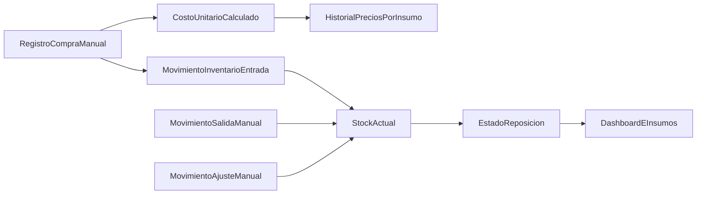

# Plan v2: Historial de precios e inventario

## Objetivo

Agregar dos capacidades al sistema actual:

- Historial de precios por insumo y proveedor, registrando compras manuales con fecha.
- Inventario con movimientos (entradas, salidas, ajustes) y alertas visuales por stock mínimo.

La implementación mantiene el stack actual y evita integraciones externas en esta fase.

## Alcance acordado

- **Historial de precios:** registro manual de compras por insumo/proveedor (precio, cantidad, fecha, costo unitario derivado).
- **Inventario:** movimientos manuales con cálculo de stock actual por insumo.
- **Alertas de reposición:** semáforo visual por insumo comparando stock actual vs stock mínimo.

## Cambios de modelo de datos

Extender [prisma/schema.prisma](prisma/schema.prisma) con:

- **Proveedor**: `id`, `nombre`, `contacto?`, timestamps.
- **CompraInsumo**: `id`, `insumoId`, `proveedorId?`, `fechaCompra`, `cantidadCompra`, `unidadCompra`, `precioTotal`, `costoUnitarioCalculado`, timestamps.
- **InventarioInsumo** (snapshot): `insumoId` único, `stockActual`, `stockMinimo`, `updatedAt`.
- **MovimientoInventario**: `id`, `insumoId`, `tipo` (`ENTRADA|SALIDA|AJUSTE`), `cantidad`, `motivo?`, `fechaMovimiento`, `referenciaCompraId?`, timestamps.

Notas:

- Reusar `UnidadBase` para consistencia de unidades.
- Definir reglas de signo por tipo de movimiento para mantener trazabilidad.

## Reglas de negocio

- **Compra manual:** permite capturar precio total y cantidad; el sistema calcula y guarda costo unitario comparable.
- **Stock actual:** suma de movimientos por insumo (entradas +, salidas -, ajustes +/- según valor).
- **Alerta reposición:**
  - `rojo`: stockActual <= stockMinimo
  - `amarillo`: stockActual <= stockMinimo * 1.2
  - `verde`: resto
- **Consumo por receta (manual en v2):** registrar salida con motivo para mantener auditoría.

## API v2 propuesta

Nuevas rutas:

- `GET/POST /api/proveedores`
- `GET/POST /api/compras-insumos`
- `GET /api/insumos/:id/historial-precios`
- `GET/PATCH /api/insumos/:id/inventario`
- `GET/POST /api/movimientos-inventario`
- `GET /api/inventario/alertas`

Ajustes en rutas existentes:

- `GET /api/insumos` incluir resumen de stock y estado de alerta para listado.

## Frontend v2

Nuevas pantallas/módulos:

- [app/insumos/page.tsx](app/insumos/page.tsx): añadir pestañas **Insumos | Compras | Inventario**.
- Nueva vista de compras: formulario de compra + historial por insumo/proveedor.
- Nueva vista inventario: stock actual, stock mínimo editable y botón de movimiento manual.
- Dashboard inicial [app/page.tsx](app/page.tsx): tarjeta de alertas de reposición.

Componentes candidatos:

- `components/proveedores/ProveedoresModule.tsx`
- `components/compras/ComprasInsumosModule.tsx`
- `components/inventario/InventarioModule.tsx`
- `components/inventario/AlertasInventarioCard.tsx`

## Flujo funcional

## Fases de implementación

1. **Datos y migraciones**
  - Modelos Prisma, relaciones, índices y migración.
  - Seed mínimo de proveedores y stock inicial opcional.
2. **Servicios de dominio**
  - Cálculo de costo unitario por compra.
  - Servicio de stock consolidado y semáforo.
3. **APIs**
  - CRUD/queries de compras, proveedores y movimientos.
  - Endpoints de historial y alertas.
4. **UI**
  - Módulos de compras e inventario.
  - Alertas visuales integradas en listados.
5. **Calidad**
  - Tests de reglas de stock y alertas.
  - Pruebas de regresión de costeo actual.

## Validación y métricas de éxito

- Registrar una compra y verla en historial en < 1 min.
- Reflejar stock actualizado inmediatamente tras cada movimiento.
- Ver alertas correctas en al menos 3 escenarios (verde/amarillo/rojo).
- Mantener funcionando flujo actual de recetas y precio sugerido sin regresiones.

## Riesgos y mitigaciones

- **Unidades inconsistentes en compras:** validar compatibilidad unidad compra vs unidad base y convertir de forma explícita.
- **Stock negativo accidental:** bloquear o advertir en salidas que excedan stock (según política configurable).
- **Sobrecarga en UI de insumos:** separar por pestañas para mantener claridad operativa.

